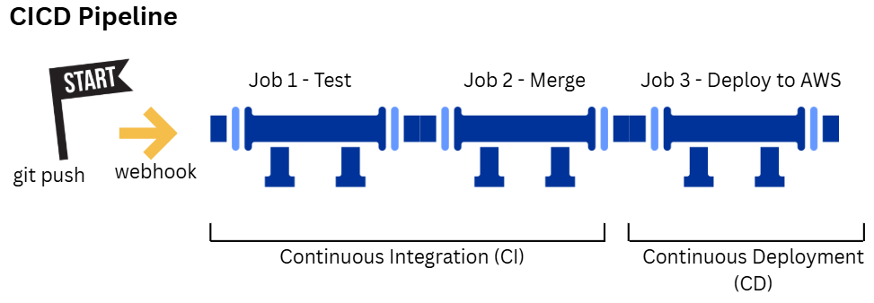
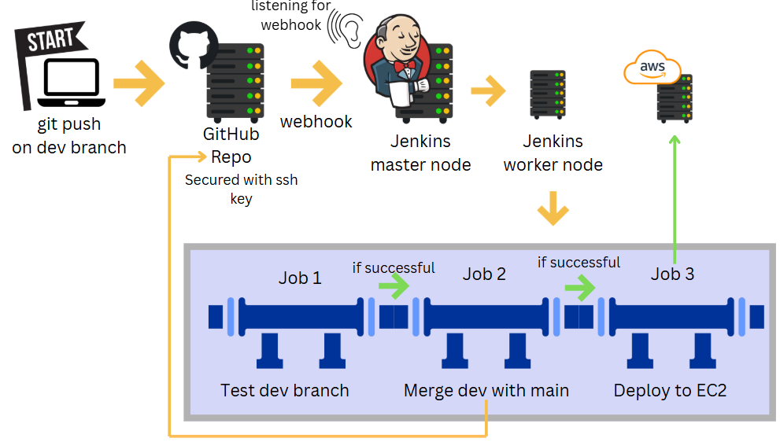

# CICD

- [CICD](#cicd)
  - [Introduction](#introduction)
    - [What is CI?](#what-is-ci)
    - [Benefits of CI](#benefits-of-ci)
    - [What is CD? Benefits?](#what-is-cd-benefits)
    - [Continuous Delivery](#continuous-delivery)
    - [Continous Deployment](#continous-deployment)
    - [Benfits of Continous Delivery](#benfits-of-continous-delivery)
    - [Benefits of Deploying Automatically](#benefits-of-deploying-automatically)
  - [What is Jenkins?](#what-is-jenkins)
    - [Why use Jenkins? Benefits of using Jenkins?](#why-use-jenkins-benefits-of-using-jenkins)
    - [Disadvantages](#disadvantages)
    - [Stages of Jenkins](#stages-of-jenkins)
    - [What alternative are there for Jenkins](#what-alternative-are-there-for-jenkins)
  - [Why build a pipeline? Business value](#why-build-a-pipeline-business-value)
  - [Our Pipeline](#our-pipeline)
    - [Pipeline Stages:](#pipeline-stages)
    - [Authentication and Access](#authentication-and-access)
    - [Creating gitHub repo from another gitHub repo](#creating-github-repo-from-another-github-repo)
    - [Making new branch](#making-new-branch)


## Introduction
### What is CI?

**Continuous Integration** 
- Merging (or integrating) code into a central location
- Triggered by: pushes (Developers pushing the code changes to a shared repo)
- Before code is merged into the main branch: code needs to be approved and tested - this can be manual - in CI is automated?
- Tests are run automatically on the code before it is integrated into the main code
  
### Benefits of CI

- Tests are automatically run before merges:
  - helps identify and resolve bugs quickly and early
  - reduces costs
  - simplifies project management
- Helps to maintain a stable and functional software build

In Waterfall, doing tests at end, means that incompatibilities can arise to late to fix. And whole projects, after years of work, finding code can't be integrated

Developers and testers test their code before the CICD pipeline, but CI acts as safety net and quality assurance

### What is CD? Benefits?
Can mean:
- **Continous Delivery** (manual sign off/approval)
  
  OR 
- **Continous Deployment** (automatically deploys code to production)

### Continuous Delivery
- A product is ready to deliver at any time
- Ensure software is always in a deployable state
- Often involves producing a deployable artifact (a package of code - already compiled, waiting ready to be deployed)
- Requires a manual approval or release decision

### Continous Deployment
- Extension of continous delivery, through automating the final steps of deploying to production
- No manual approval/intervention
- Nenefit which is also a disadvantage: manual approval is safer
- Removes human approval, relies entirely on automation
  
Developing pushes code -> CI tests automatically -> passes test -> gets put in artifact -> CD -> deployed -> end users can interact with new change

This can be as fast as minutes
End users understand they will have latest features immediately, but there can be bugs, so there is a place for quick feedback

Fast feedback cycle with CICD pipeline with continous deployment

DevOps is all about a continous cycle of improvemnt -> CICD is one of the most important factors in this process


### Benfits of Continous Delivery
- Always have a deployable artifact ready to deploy to end users
- Get new working software faster
  
### Benefits of Deploying Automatically
- Get new working software faster

  
## What is Jenkins?
- An automation server
- It is open source
- Primarily used for CICD, but can automate much more

### Why use Jenkins? Benefits of using Jenkins?

- inustry standard
- automates entire CICD
- reduces human error
- extensibility: over 1,000 plugins - supports wide variaety of tools and workflows
-  scaleability: uses nodes or agnets to distribute the workload
   -  scales easily by adding/using worker nodes/agents to run jobs
- Community support
- customisation to work flow
- cross-platform: works across windows, linux, macOS

### Disadvantages
- complex setup, harder for beginners as it has a lot of plugins
- maintainance overhead (if lots of plugins, lots of plugins to update, as well as the versions of jenkins)
- resource intensive when running multiple jobs (depends on how optimised it is)
- user interface: outdated compared to modern tools

### Stages of Jenkins

A typical Jenkins CICD pipeline involves the following stages:

1. Source code management (SCM)
   - gets the code from somewhere usually version control system like git
2. Build 
   - Compile the code, build into executale artifact
3. Test
   - unit, integration, to verify build functions as it should
4. Package
   - package into deployable artificat
5. if using continous deployment    
   - package is deployed into the target environment
   eg. testing/production
6. Monitor
   - monitoring tools may be deployed/configured to observe and log issues after deployment

### What alternative are there for Jenkins

- GitLab CI
- GitHub Actions
- CircleCI
- Travus CI
- Bamboo
- TeamCity
- GoCD
- Azure DevOps/Azure Pipelines to run the CICD pipelines 

## Why build a pipeline? Business value


- cost effective - reducing manual work
  - automating repetitive processes
- faster time to market
- reduced risk
  - minimise manual errors
  - reduce risk of deployment failures
- scaleability 
  - can grow even with complex systems 
- improved quality
  - going through a set of standard tests
  - continous feedback - end users testing sooner

## Our Pipeline


Our Pipeline
  Starts with trigger 
  - a git push from a developer
  - needs a web hook
  - Jenkins listening to when web hook works (so CICD pipeline can work)
  
### Pipeline Stages:

1. Test
   - get latest version of code, and run unit test
  
   - If tests pass:
2. Merge
   into main branch

3. Deploy

CI: test and merge
CD: deploy to AWS

Dev journey
1. Dev does a git push to GitHub repo
   on dev branch
2. GitHub sends a web hook
3. Jenkins receives the web hook
   as Jenkins is listening* for web hook
Jenkins is made of the master node (builtin node) -> it uses agent/worker nodes** to carry out the jobs (for scaleability)

**agent nodes can be AWS EC2 instances to run the jobs

> Jenkins can be set up with one builtin node to run the jobs
> 
> However if any of the jobs crash, the Jenkins server might crash and become unresponsive (not allow any more jobs)
>
> Also if jobs are workinng on same jenkins, can be bad for security

```
| Developer | -- git push --> | GitHub | -- web hook --> | Jenkins (listening for web hooks) |
```

*unlike polling -> keep, repeatedly asking for update

Our pipeline will have 3 jobs (as above):

**Job 1: Test** - test code in dev branch, clones repo, gets source code, build, runs unit test
|
if result successful
|
V
**Job 2: Merge** - merge the code from the dev branch into the main branch
|
if result successful
|
V
**Job 3: Deploy** - deploy the code (which has been tested) to a running EC2 instance, where we're deploying the app

Code that gets deployed should be the code tested on the Jenkins server, not from source GitHub/git clone from main (as there could be new pushes there, that haven't been tested)



### Authentication and Access

- GitHub repo needs public key to secure the repo

- Jenkins needs private key
  - Give Jenkins access to read/write to GitHub repo with the private github private key
  - Jenkins needs to be able to merge onto GitHub repo so will need authentication for read/write

- Jenkins needs to AWS private key to copy code to EC2 instaces
  - as rsync/scp uses ssh authentication


1. set up github repo - with app code
   1. set up dev and main branch 
2. give public key to secure the repo
3. give jenkins private key to allow merges
4. Job 1
5. webhook
6. job 2
   1. private key to ec2 instance
7. job 3

1. Create GitHub repo
   with app folder repo/app/

### Creating gitHub repo from another gitHub repo

- make a folder called `tech515-sparta-test-app-cicd` for the new git repo
- do a git clone of the old github repo, the app

(How does git clone work? Where does it put things?)
renamed it app (cos I'd removed that originally)
(better is to change origin, ignore below)

- delete the .git so it wasn't linked to that git (Not best practice)
  
- then make a new repo with same name as git repo
- In the new git repo `git remote add origin https://github.com/nettie168/tech515-sparta-test-app-cicd.git`
- `git origin`
- `git add`
- `git commit`

### Making new branch

`git checkout -b new-branch-name`

branch-name used was dev so

`git checkout -b dev`

It creates the branch dev and switches to that branch

`git push origin new-branch-name`
