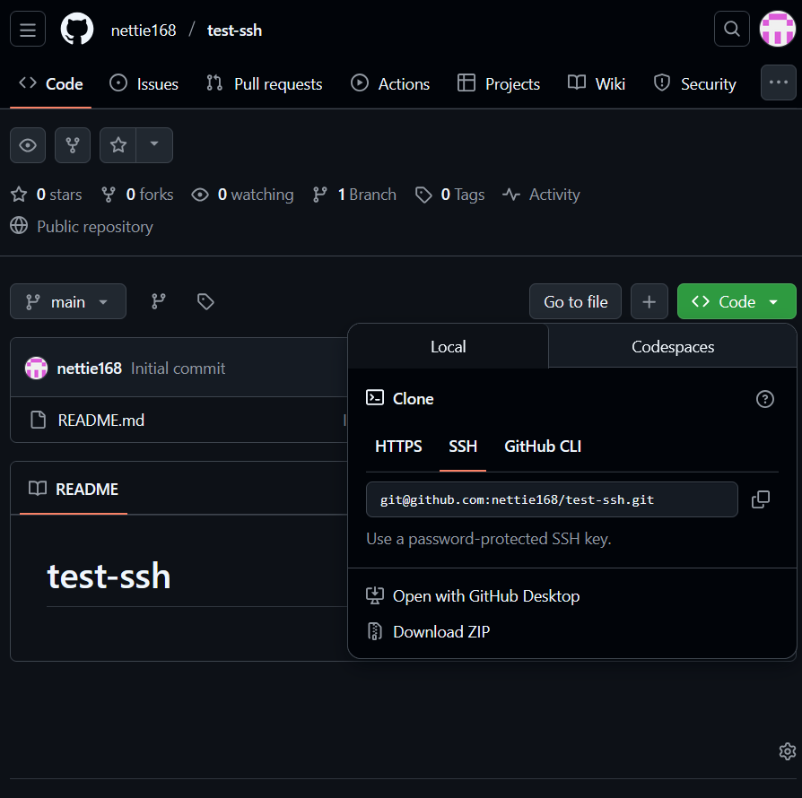

# SSH authentication with GitHub repo

- [SSH authentication with GitHub repo](#ssh-authentication-with-github-repo)
  - [Pushing to GitHub](#pushing-to-github)
  - [How to secure git repo on GitHub with ssh](#how-to-secure-git-repo-on-github-with-ssh)
    - [Format of Key pairs](#format-of-key-pairs)
    - [1. Create SSH Key pair](#1-create-ssh-key-pair)
    - [2. Register Padlock](#2-register-padlock)
    - [3. Add Private Key to SSH Register (locally with CLI?)](#3-add-private-key-to-ssh-register-locally-with-cli)
      - [The ssh agent](#the-ssh-agent)
    - [4. Test the connection](#4-test-the-connection)
    - [5. (Create) Sync repo](#5-create-sync-repo)
    - [6. Push changes](#6-push-changes)


## Pushing to GitHub

You can push to github in a number of ways including via https and ssh.

Both require a form of authentication to sync (git push) to GitHub


```
     __________
    | git repo |     authenticate (HTTPS/SSH)     __________
    |          | ------------------------------> | GitHub   |
    |__________|                                 |          |
   /           /                                 | git repo |
  /__________ /                                  |__________|
  local machine
```
_fullscreen to see diagram_


Both methods can be useful dependending on how you want to push changes. 

ssh authentication can be used with Jenkins. It has a few more steps than for https

1. Create the ssh key pair
2. Register the padlock
3. Add the private key to the register
4. a. Create a test GitHub repo
4. b. Create a test local repo
5. Push changes to remote repo

```
     __________
    | git repo |     authenticate with SSH        __________
    |          | ------------------------------> | GitHub   |
    |__________|                                 |          |
   /           /                                 | git repo |
  /__________ /                                  |__________|
  local machine

  1. Create SSH key pair (rsa)                2. Register Padlock
           /\                      
          /  \
         /    \
    public   private
    key      key

  2. Add private key to SSH                   4a. Create a test GitHub
     register                                     repo

  4b. Create a test local repo

  5. Push changes to remote
     repo
```


## How to secure git repo on GitHub with ssh

First we need an SSH key pair to use SSH

There are a few types of key, we'll be using **RSA**

> RSA is an older algorithm for generating keys, but it is very secure
>
> 4096 is the size of the key

### Format of Key pairs

Key pairs have: **public key** and **private key**

- public key: stored on remote (acts like a lock)
- private key: stored locally (acts as a key)
  

### 1. Create SSH Key pair

Some key pairs are generated by remote organisation like AWS

Otherwise can generated yourself via:

`cd ~/.ssh`

`ssh-keygen -t rsa -b 4096 -C "antoinette.alevropoulos@gmail.com"`

Name it: 
`nettie-github-key`

> very sensitive, type exactly as, or it can get weird

empty passphrase (press enter)
and do again

> Check it's there with `ls`

### 2. Register Padlock

Gives read and write access to ALL repos on GitHub


settting > ssh and gpg key

click `new ssh key`

put in name (without extension)

copy and paste in the public key `.pub`


### 3. Add Private Key to SSH Register (locally with CLI?)

Run the ssh agent

```
eval `ssh-agent -s`
```
Those are backticks

#### The ssh agent
- what does it do?
- is session dependent
- have to run each time doing git push?
- or just once??

gives a process id if it has run correctly eg `Agent pid 570`

With ssh agent running, add private key

`ssh-add nettie-github-key`

`Identity added: nettie-github-key (antoinette.alevropoulos@gmail.com)`

### 4. Test the connection

`ssh -T git@github.com`

```
The authenticity of host 'github.com (20.26.156.215)' can't be established.
ED25519 key fingerprint is: SHA256:+DiY3wvvV6TuJJhbpZisF/zLDA0zPMSvHdkr4UvCOqU
This key is not known by any other names.
Are you sure you want to continue connecting (yes/no/[fingerprint])? yes
Warning: Permanently added 'github.com' (ED25519) to the list of known hosts.
Hi nettie168! You've successfully authenticated, but GitHub does not provide shell access.
```
Type `yes` to authenticate connection

### 5. (Create) Sync repo
Create new repo: test-sh



copy ssh endpoing for github repo

go to github

`git clone git@github.com:nettie168/test-ssh.git`

`ls`


### 6. Push changes

make a change, add to staging, and commit
(see [git commands](../../0_Linux/Commands/git_commands.md))

`git push`

Check changes have been pushed to remote GitHub repo

> Can change back to HTTPS with remote origin, and change the endpoint