# How to build a 3-job CICD Pipeline with Jenkins

- [How to build a 3-job CICD Pipeline with Jenkins](#how-to-build-a-3-job-cicd-pipeline-with-jenkins)
  - [The Pipeline Plan](#the-pipeline-plan)
- [How to use Jenkins](#how-to-use-jenkins)
  - [Log into Jenkins Server](#log-into-jenkins-server)
  - [Making a Jenkins Project](#making-a-jenkins-project)
    - [1. Add item](#1-add-item)
    - [2. Configure](#2-configure)
    - [3. Build](#3-build)
    - [4. Check outputs](#4-check-outputs)
    - [Creating a Multistage pipeline (Chaining jobs/projects)](#creating-a-multistage-pipeline-chaining-jobsprojects)
- [Building the Pipeline](#building-the-pipeline)
  - [1. Make the GitHub Repo](#1-make-the-github-repo)
  - [2. Secure GitHub repo with public key](#2-secure-github-repo-with-public-key)
    - [1. Generate new key pair "nettie-jenkins-2-github-key"](#1-generate-new-key-pair-nettie-jenkins-2-github-key)
    - [2. Secure repo on git](#2-secure-repo-on-git)
  - [3. Job 1 - Test Code](#3-job-1---test-code)
    - [1. Set up project](#1-set-up-project)
    - [2. Set up Source Code Management](#2-set-up-source-code-management)
      - [Add the ssh private key](#add-the-ssh-private-key)
    - [3. Set up Build Environment](#3-set-up-build-environment)
      - [Build Trigger](#build-trigger)
      - [Allowing node](#allowing-node)
      - [Build Steps](#build-steps)
    - [Manually build](#manually-build)
  - [3b. Setting up the webhook](#3b-setting-up-the-webhook)
      - [Getting Jenkins to listen](#getting-jenkins-to-listen)
      - [Setting GitHib webhook](#setting-githib-webhook)
  - [4. Job 2 - Merge](#4-job-2---merge)
    - [1. Set up Jenkins Project](#1-set-up-jenkins-project)
    - [2. Merge and push using Git Publisher](#2-merge-and-push-using-git-publisher)
    - [3. Set up pipeline](#3-set-up-pipeline)
    - [4. Check it worked](#4-check-it-worked)
      - [On jenkins](#on-jenkins)
      - [On GitHub](#on-github)
  - [5. Job 3 - Deploy](#5-job-3---deploy)
    - [1.  Make project](#1--make-project)
      - [1. Set up Project](#1-set-up-project-1)
      - [2. Set up Build Environment](#2-set-up-build-environment)
      - [3. Build Steps](#3-build-steps)
    - [2. Link to job 2](#2-link-to-job-2)
    - [3. Check test worked](#3-check-test-worked)
    - [4. Copy code and run app through ssh](#4-copy-code-and-run-app-through-ssh)
    - [5. Test Deployment](#5-test-deployment)


## The Pipeline Plan

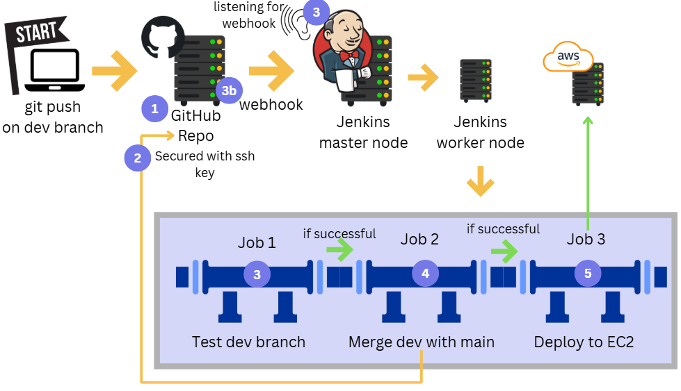

See [README.md](./CICD/README.md#our-pipeline) for more detail on our pipeline plan

The order to make our CICD pipeline:

- 1. Create the GitHub repo
- 2. Secure the repo with the ssh key
  
- 3. Create Job 1, with Jenkins listening for web hook
    - 3b. Create the web hook
- 4. Create Job 2
- 5. Create Job 3
  
# How to use Jenkins

This is the methodology for how to implement our CICD Pipeline using Jenkins.

For more about Jenkins see [README](./CICD/README.md#what-is-jenkins)

## Log into Jenkins Server

Go to server at IP, through port 8080 eg `http://34.254.6.118:8080/` and sign in with username and password.

- Jenkins uses port 8080

This set up has worker nodes with AWS EC2 instances with ubuntu 22.04 as this is what are app and db are tested on.

## Making a Jenkins Project

> Everything on jenkins is called a project - each job is a project. Link projects to form a pipelin

Once you have run a job, it is called a build
Get an icon for it was successful, and a weather (general feel) for last number of builds

green tick - good
red cross - failed/went wrong

### 1. Add item

`+ New Item`

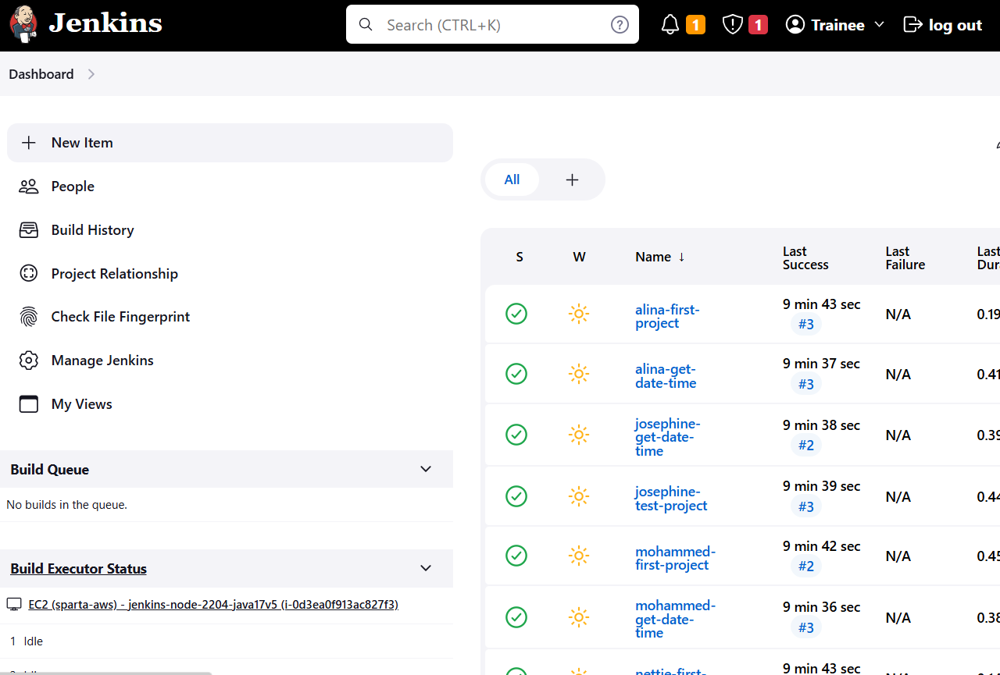

`Enter name`

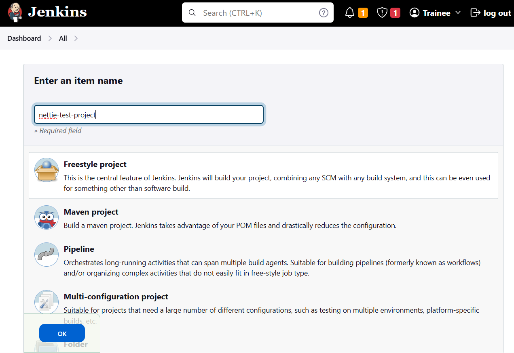

Select `Freestyle project`

And `ok`

> Note: Can duplicate with Copy from (make sure to have different name at top)
> This will be used to create Jobs 2 and Job 3 further on

### 2. Configure
   
Go to Configure

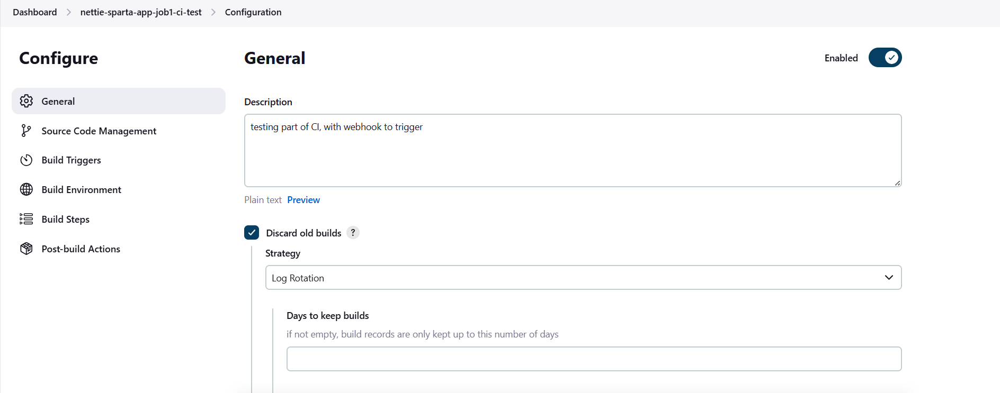

Add the description

Tick discard old builds

> A new build is made every time it runs, ticking this means it will delete old builds

set `max # of builds` to 5 (5 runs, at 6th the oldest build is deleted)

Got to `build steps`

drop down, select `execute shell`

bash commands can go in the box

For this test, we're using
`uname -a` to find version of linux

`save`

Can click `configure` in menu to change details later

### 3. Build 
   
`Build now`, manually triggers without a webhook. Helpful during this testing stage


### 4. Check outputs

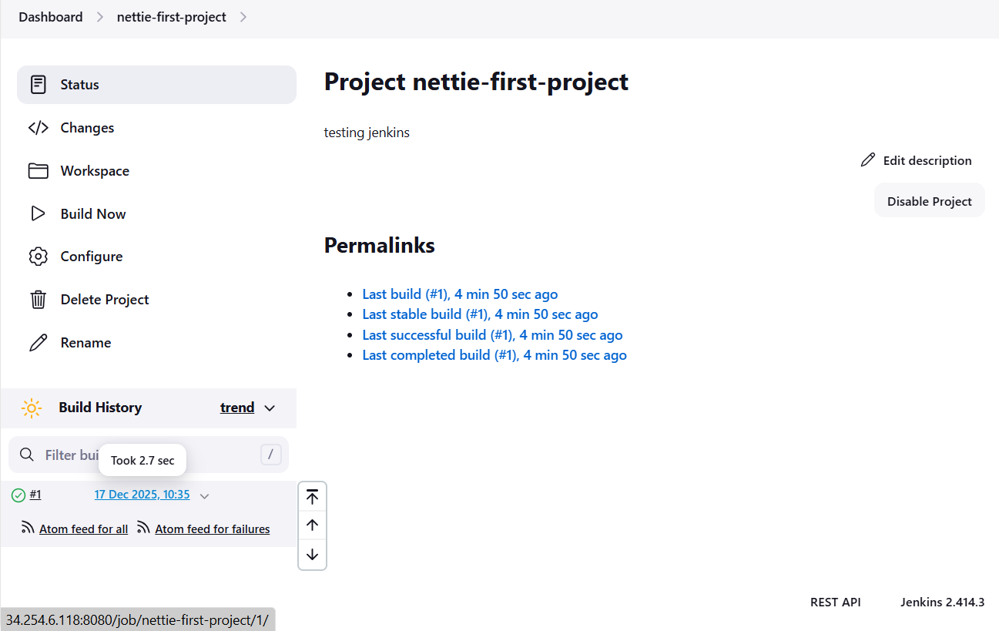

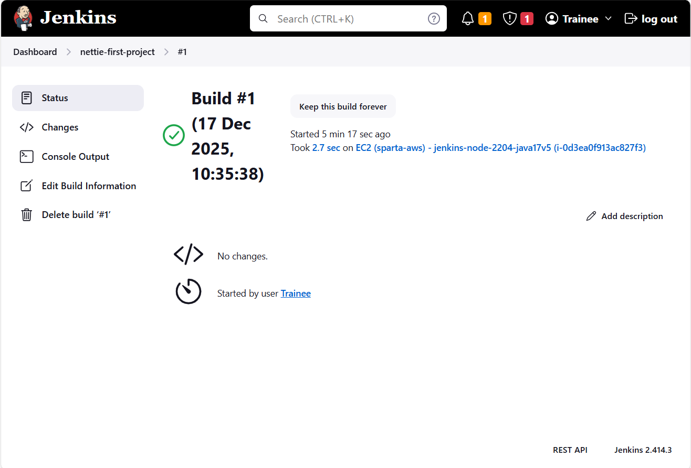

Console Output -> shows what you ran

Can see in real time as it's running on worker node

And see the outputs as would be shown in a terminal.

### Creating a Multistage pipeline (Chaining jobs/projects)

Project -> `post build actions`

Trigger only if build stable

-> As we're only running next if successful

...

Take out space and comma, if running just one after

Got to project
Console
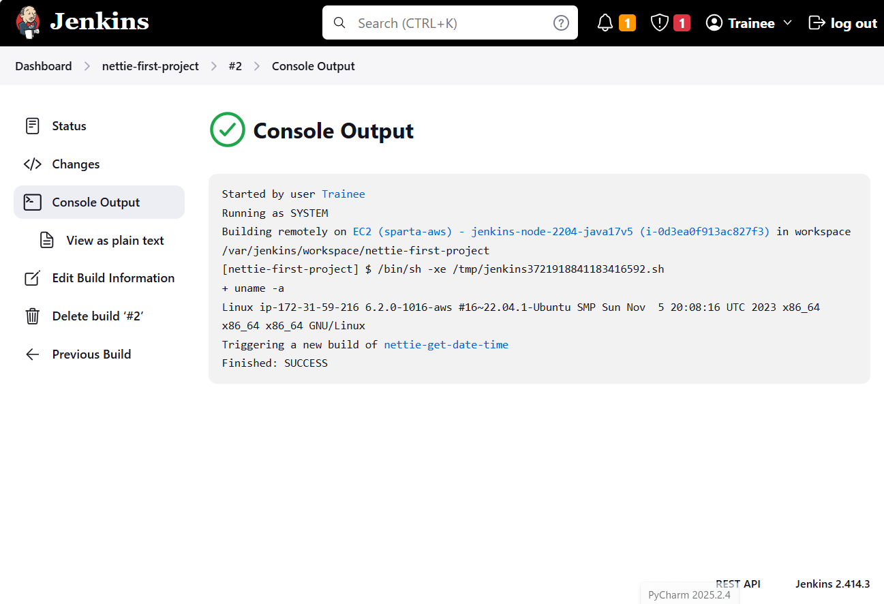


Got to second job -> Console

Shows that the build was triggered by the job ....
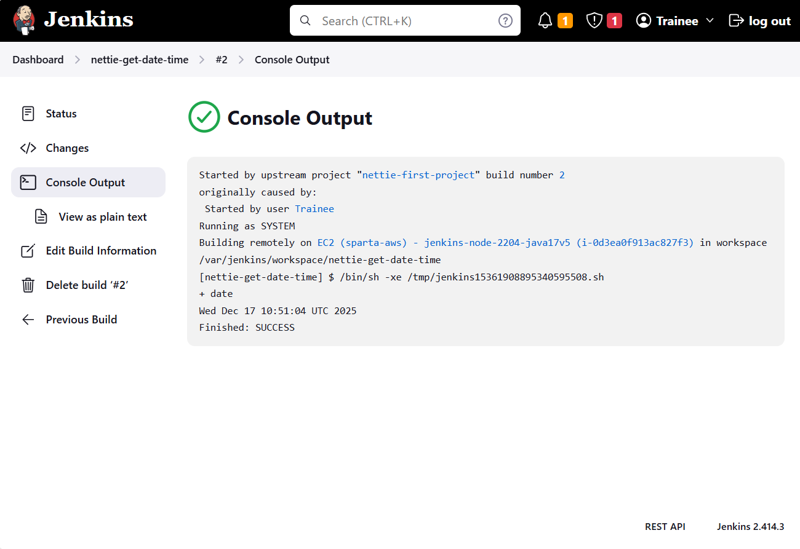

<br>

# Building the Pipeline

## 1. Make the GitHub Repo

See [README.md](./CICD/README.md#our-pipeline)

## 2. Secure GitHub repo with public key

Specifically set up access only to just this repo

### 1. Generate new key pair "nettie-jenkins-2-github-key"

Some key pairs are generated by remote organisation like AWS

Otherwise can generated yourself via:

`cd ~/.ssh`

`ssh-keygen -t rsa -b 4096 -C "antoinette.alevropoulos@gmail.com"`
4096 bites long -> very hard to crack
made with rsa algorithm

Name it: 
`nettie-jenkins-2-github-key`

> Note: Key creation is very sensitive, type exactly as, or it can get weird

empty passphrase (press enter)
and do again

- Check the keys are there with `ls`

### 2. Secure repo on git

go to github account

go to your repo

Got to individual repo settings

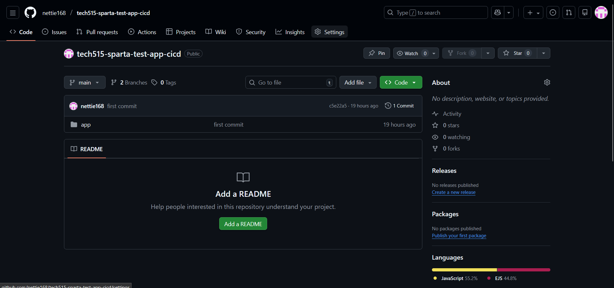

`deploy keys`

put in `nettie-jenkins-2-github-key`

copy in public key (cat key)

> Note: when copying in the public key make sure it's all characters and no more
>

press `clear` in terminal to wipe hitry

tick allow write access so Jenkins can push changes and merge to github repo, which requires write access

Result: key that we added to repo

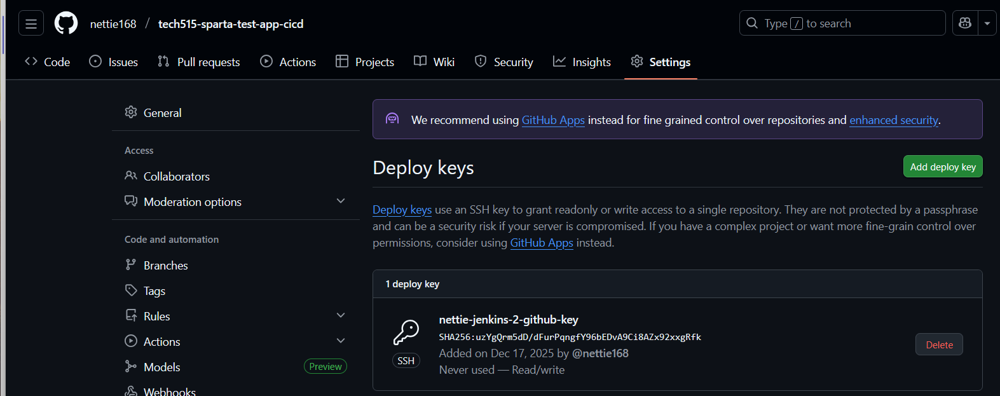

## 3. Job 1 - Test Code
### 1. Set up project
Set up access so jenkins can get code from github repo

`nettie-sparta-app-job1-ci-test`


as before

- add a description
- tick discard old build
- set `# max builds` to 5
- then tick github project
- we want https endpoint

get from repo
`https://github.com/nettie168/tech515-sparta-test-app-cicd.git`

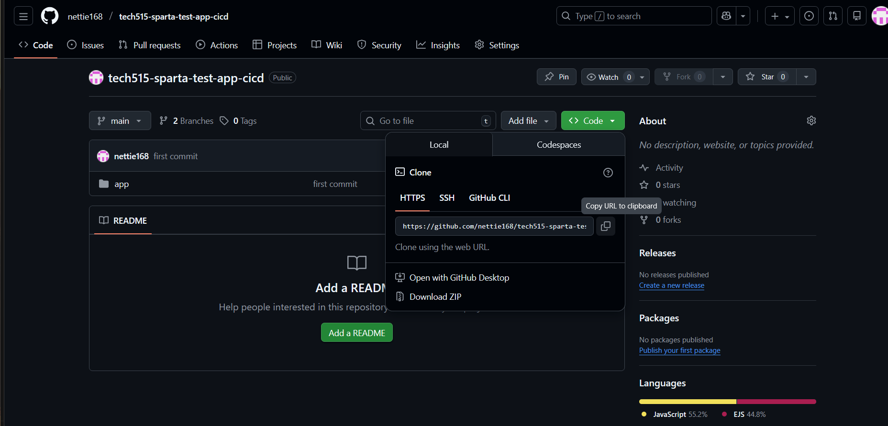

remove the .git replace with /

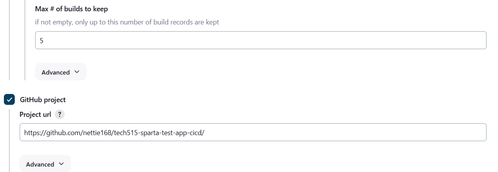


### 2. Set up Source Code Management
Select `git`

We are using ssh keys to authenticate, so need ssh endpoint (from same as before)

`git@github.com:nettie168/tech515-sparta-test-app-cicd.git`

Without the key you'll see this error message:

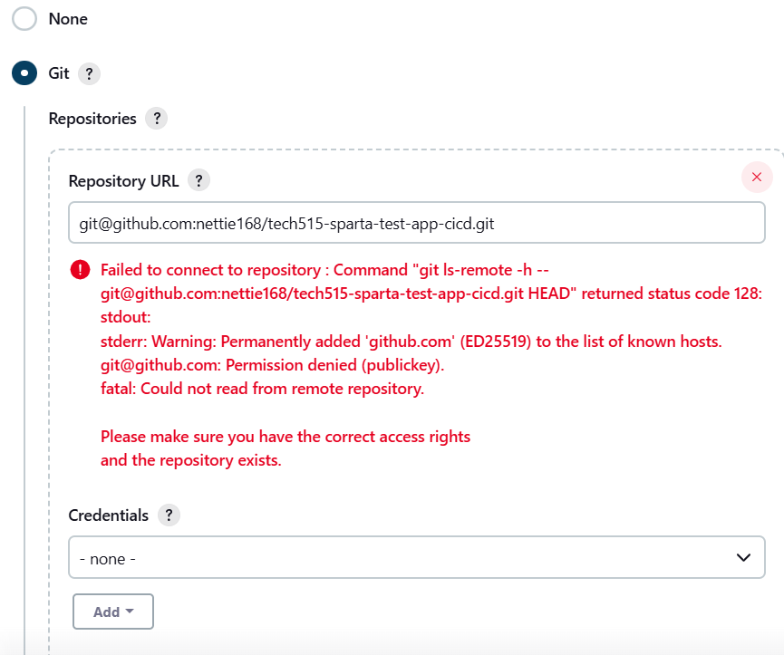

So next we need to add the private key so that Jenkins can have read/write access to the secure gitHub repo

#### Add the ssh private key

Under `Credentials` click `add` then `Jenkins`

Select the `kind` of credential as `ssh  Username with private key`

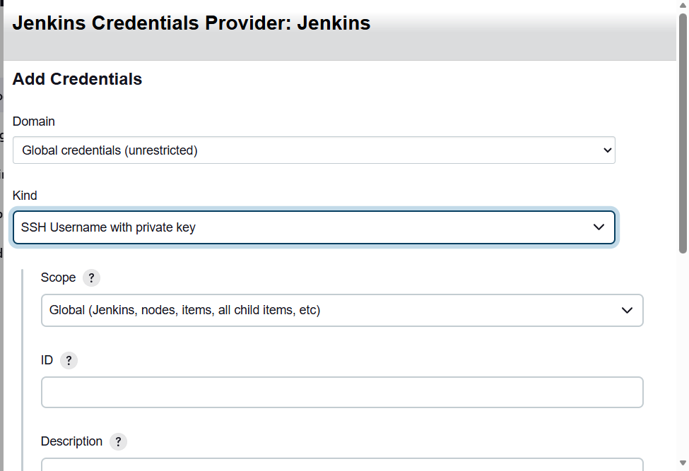

Then put in the details for the key:

- id: `nettie-jenkins-2-github-key`
- username: `nettie-jenkins-2-github-key`
- description: to read/write to repo

`enter directly`

`add`

paste in private ssh key from the key pair used to secure GitHub repo 

> Note: Remember to `clear` to remove your private key from history and CLI.
> All of it, but no more (include all --- but no extra spaces). And check it is the right private key!!!

You will still get red error until you select your key from the dropdown

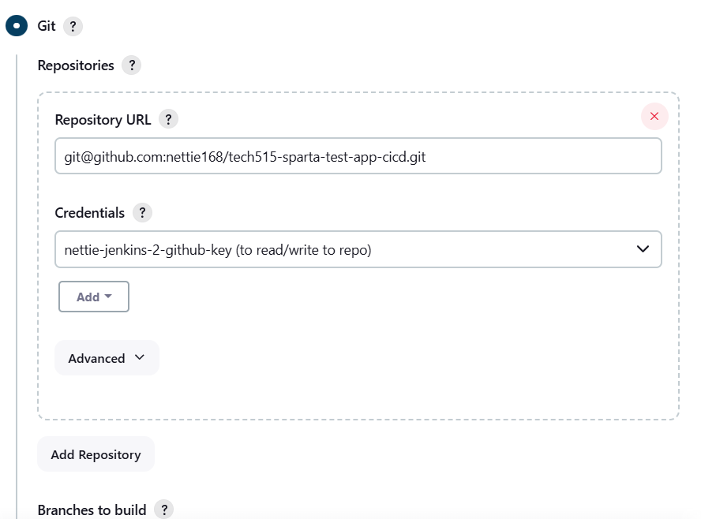

The error now goes away as it has the right private key

set to branch to `main` or `dev`, whichever branch the pushes will be to

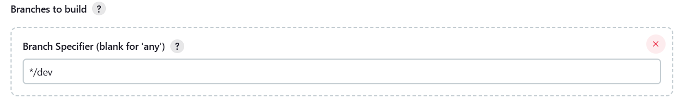

> If you copy this project for a new job then you'd work on same set of files. Same SCM settings. Provided the jobs were in the same pipeline (and so running on the same worker node)

### 3. Set up Build Environment

Now we set the Build Environment for Testing

#### Build Trigger

The Build will be triggered by a web hook

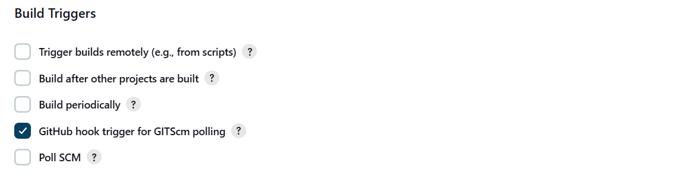

#### Allowing node

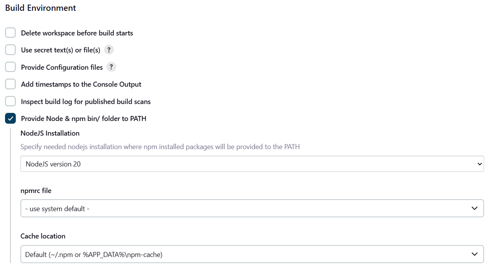

Ensure correct version of node

#### Build Steps

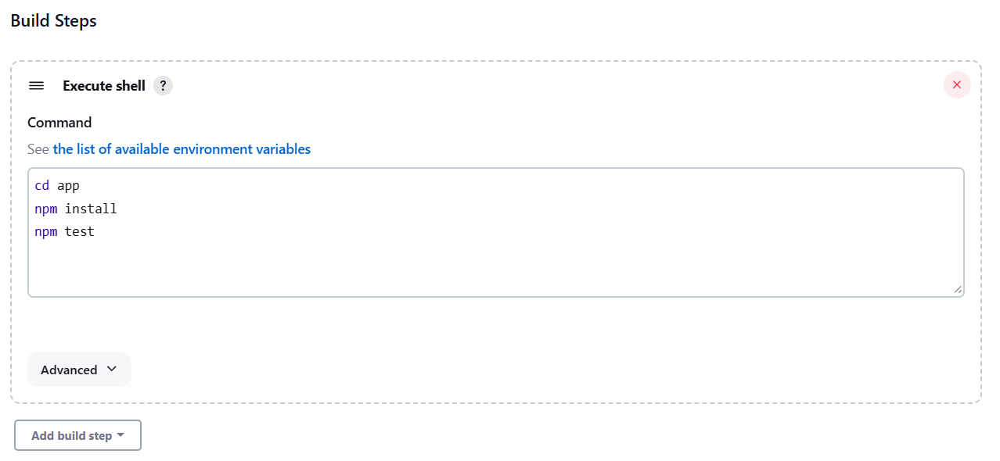

`execute shell`

the shell works as if you'd cd into the repo already

so you need to
`cd app` to make sure you're in the same dir as node.js app

`npm install` -> installs app dependeciess

`npm test` -> runs unit test


`save`


### Manually build

Manually build, then the job will go into the Build Queue, and then the Build executor

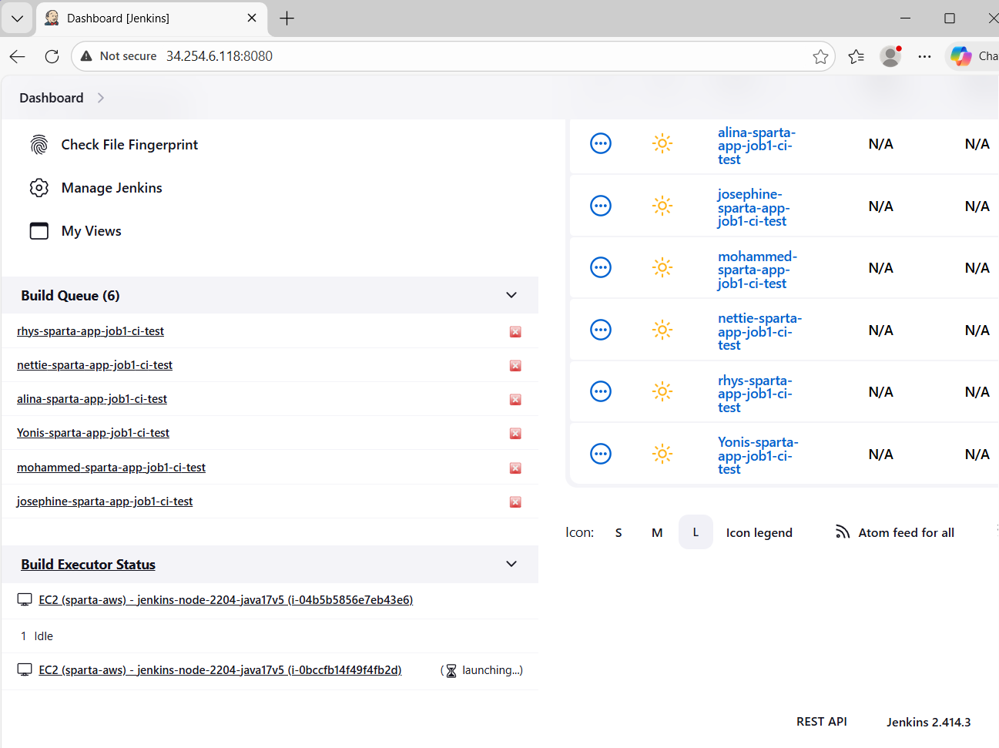

In Console you can see the results of the Unit Test:
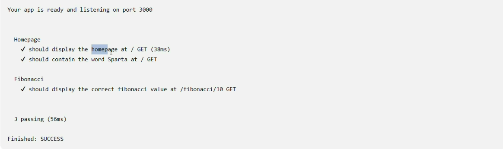

In Dashboard, shows green tick to mean it passed its unit test, and sunshine for weather (latest history of runs - good)


## 3b. Setting up the webhook

Now that Jenkins is set up to be listening for the web hook, we need to set it up, since the web hook is make of 2 parts:

1. get github to send webhook when push
2. jenkins to be listening for webhook


#### Getting Jenkins to listen

We already set this up when we created the first job.

job -> config -> build -> trigger

tick github trigger

#### Setting GitHib webhook

github repo -> setting webhooks -> add webhook

set `payload url` - the url that needs to recieve the notification -> the jenkins server url
`http://34.254.6.118:8080/github-webhook/`

by default:
- enable ssl verification
- just push the event
- active

add webhook

Result:

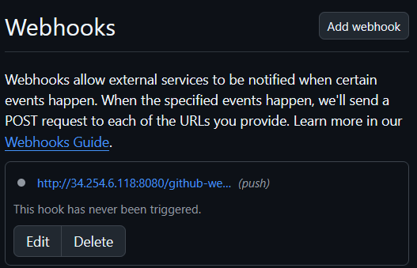


test > make a change

then push

Check Dashboard

Job will appear


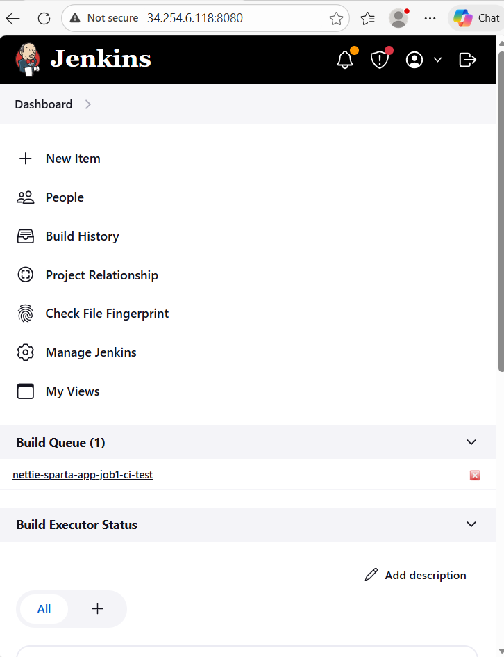


In Terminal, in git repo

`git branch dev`

`git switch dev`

change in jenkins
job > configure > scm > branch> dev

`git push --set-upstream origin dev`

Check job runs

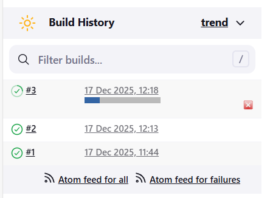

Check job is successful


So webhook works on dev branch!
Webhook on dev branch: Done!

## 4. Job 2 - Merge
doesn't need ssh agent if using git publisher
doesn't need other

### 1. Set up Jenkins Project

Make project on jenkins like before, but by duplicating job 1

Name it `nettie-sparta-job2-ci-merge`

Remove github hook as that is for job 1, job 2 will start after a successful job 1 and remove executable shell, and Node

### 2. Merge and push using Git Publisher

Go to `post build actions` select `Git Publisher` from drop down

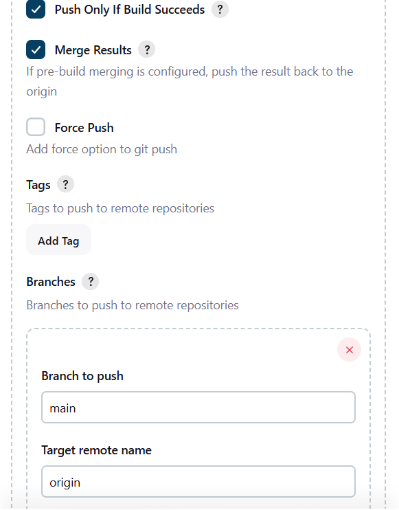

now save

### 3. Set up pipeline

now we need to set up job1, so that on successful it will trigger job 2

go to job 1 > `Configure` > `post action builds`

then select build other projects

select 2nd job (and remove ,)

`save`

### 4. Check it worked

- now check by making change and push
- check jenkins
- check github
  
#### On jenkins
job 1 in queue, jenkins spins up worker node


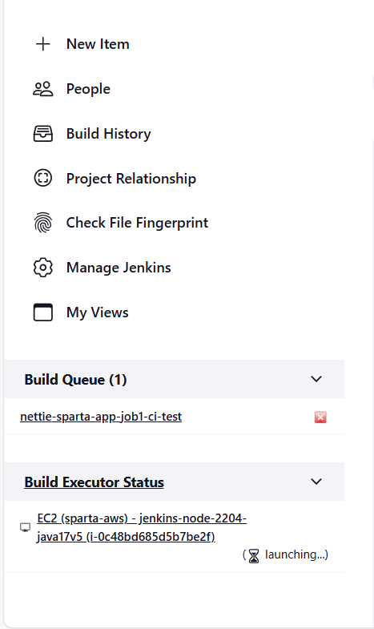

job 1 running

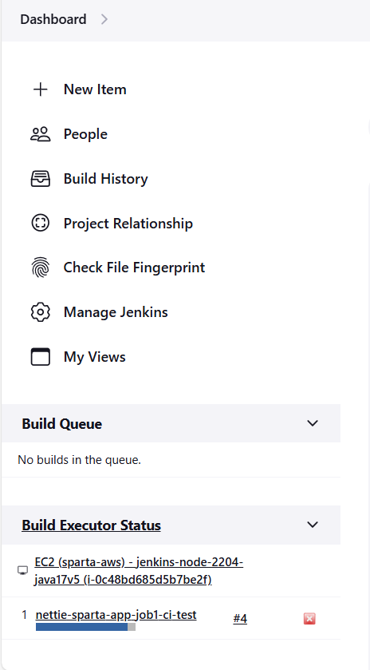

Successful


Console output for job 2 shows git changes

#### On GitHub
So we check GitHub to ensure changes occured

Result:
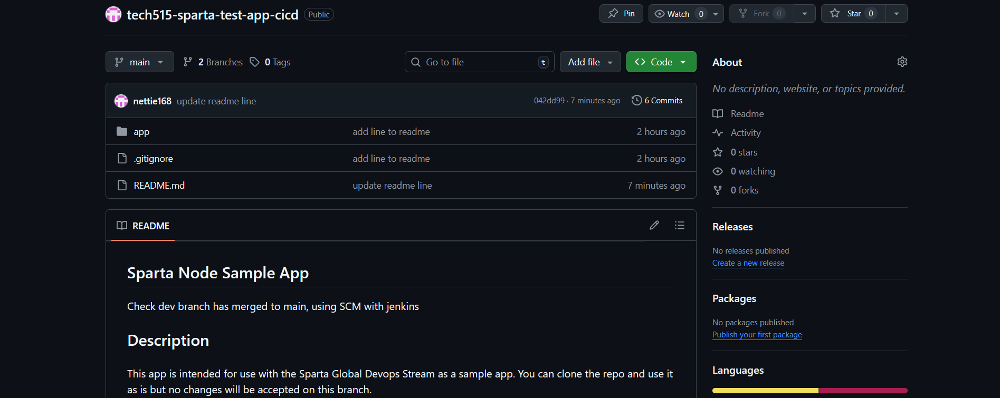

They did!

✅ Job 2: Merge. Done!

## 5. Job 3 - Deploy

The plan for deployment:

1. Have a running AWS EC2 instance with app dependencies
   (restart an app VM, or make a new one with terraform and app AMI)
   - ensure that ssh security group is allow from anywhere, so Jenkins worker node can copy across changes (using scp)
2. duplicate job 2, so that same SCM is used
3. put aws private key on jenkins, so that it can ssh and scp into AWS EC2 instance
 

### 1.  Make project

#### 1. Set up Project

- Copy from Job 2
- Name: `nettie-sparta-app-job3-cd-deploy`
- Description: copying code to ec2, ssh to ec2 and running app
- Discard old build and github project will be the same
- SCM the same
- remove git publisher (there from copy)


#### 2. Set up Build Environment

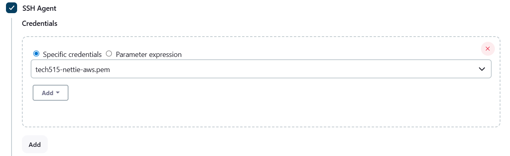
- Add private AWS ssh key to allow scp and ssh

#### 3. Build Steps

`execute shell` >  `add`

test moving over so that you know where files will be copied

add public ip of ec2 to known hosts, as without it wont be able to ssh or scp

```bash
ssh-keyscan -H 54.229.33.85 >> ~/.ssh/known_hosts

echo "file made by jenkins" > test.txt

rsync test.txt ubuntu@54.229.33.85:~/repo/.
```

> **Note:** can also fix by adding `-o StrictHostKeyChecking=no` to rsync command (then don't need to add to known hosts)

### 2. Link to job 2

go to job 2 > `post actions` > `add`

put in job, remove commas

change order, so goes after merge

`save`

### 3. Check test worked

make changes > Stage > Commit > `git push`

Job is a success! When you ssh into your app VM the test.txt appears in the repo

### 4. Copy code and run app through ssh

Now we can copy over the app (as we know we wont accidentally make multiple copies, or put it in the wrong place)

add public ip of ec2 to known hosts

(don't need known hosts as already did with test)
```bash
rsync -r * ubuntu@54.229.33.85:~/repo/.

ssh ubuntu@54.229.33.85 "cd repo/app && pm2 start app.js"
```

Next time it fails, as script already run

The && is for, do command 1 (cd /repo/app), if successful do next command (pm2 stop app.js)
```bash
ssh-keyscan -H 54.229.33.85 >> ~/.ssh/known_hosts

rsync -r * ubuntu@54.229.33.85:~/repo/.
```

For idempotency:

```bash
grep 54.229.33.85 ~/.ssh/known_hosts || ssh-keyscan -H 54.229.33.85 >> ~/.ssh/known_hosts

rsync -r * ubuntu@54.229.33.85:~/repo/.

ssh ubuntu@54.229.33.85 "cd repo/app && pm2 stop app.js || true && pm2 start app.js"
```

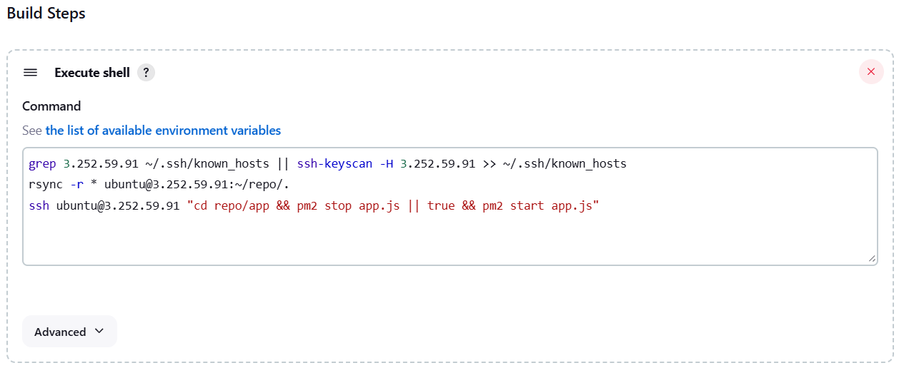

### 5. Test Deployment

Change a part of the Front Page (app/views/index.js)

Stage > Commit > Git Push

Monitor Jenkins for Jobs. Now when we go to the app IP, we can see the changes to the Front Page

Do one change, and then another change, to check. When each change can be seen one after another, deployment was a success!

✅ Job 3: Deploy. Done!


